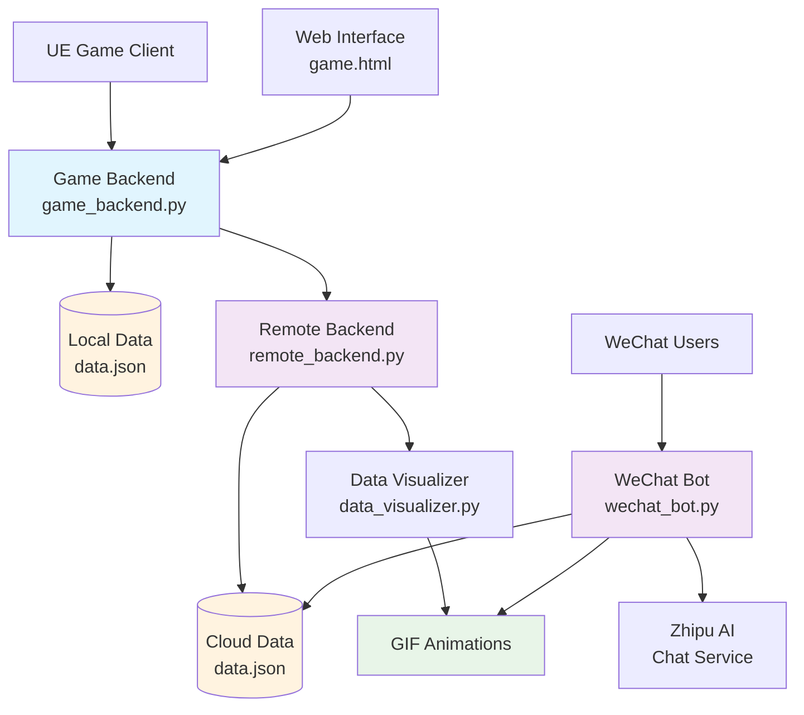

# FutureSpecimens: An Agent-Driven Social Simulation Installation

[](https://www.python.org/downloads/)
[](LICENSE)
[](https://www.microsoft.com/windows)

Official repository for the research paper "**FutureSpecimens: An Agent-Driven Social Simulation Installation**" - A social simulation system combining agent-based modeling, data visualization, and interactive installation art.

## Overview

FutureSpecimens is a research-driven social simulation platform that creates digital representations of human behaviors and social dynamics through autonomous agents. This system serves as both a research tool for studying emergent social phenomena and an interactive art installation that invites participants to explore potential futures.

The system consists of:
- A Unreal Engine-based 3D simulation environment where agents evolve based on behavioral algorithms
- A Flask backend infrastructure for data collection and processing
- Automated data visualization components that generate animated insights
- A WeChat integration system allowing participants to engage with their "future selves"
- Cloud-based data synchronization and distributed processing capabilities

## Research Context

This project was developed as part of an interdisciplinary research initiative exploring the intersection of computational social science, artificial intelligence, and interactive art. The system demonstrates how agent-based modeling can be used to simulate complex social behaviors and create meaningful participant engagement through speculative futures.

## System Architecture



### Core Components

1. **Game Backend** ([game_backend.py](file://c:\work\FutureSample\FutureSample\game_backend.py))
   - Serves the web interface and handles game data
   - Manages player data storage in JSON format
   - Coordinates data transfer to remote servers
   - Provides RESTful APIs for game clients

2. **Remote Backend** ([remote_backend.py](file://c:\work\FutureSample\FutureSample\cloud\remote_backend.py))
   - Receives and processes transferred simulation data
   - Reassigns unique identifiers for cloud storage
   - Triggers automated data visualization generation
   - Maintains synchronized data across distributed systems

3. **Data Visualizer** ([data_visualizer.py](file://c:\work\FutureSample\FutureSample\cloud\visualization\data_visualizer.py))
   - Creates animated visualizations of agent behaviors
   - Generates GIFs showing money evolution, physical/mental states, and movement trajectories
   - Processes CSV-formatted simulation output data

4. **WeChat Bot** ([wechat_bot.py](file://c:\work\FutureSample\FutureSample\cloud\wechat_bot.py))
   - Enables participant interaction through WeChat
   - Provides status updates on simulation processing
   - Facilitates conversations with "future selves" using AI
   - Offers download links for personalized visualizations

## Installation

### Prerequisites

- Python 3.8 or higher
- Windows, Linux, or macOS
- Unity Engine (for running the full simulation)
- WeChat account (for interactive features)

### Setup

1. Clone the repository:
   ```bash
   git clone https://github.com/your-username/FutureSpecimens.git
   cd FutureSpecimens
   ```

2. Install dependencies:
   ```bash
   pip install -r requirements.txt
   ```

3. Configure the system:
   - Update API keys in [zhipu_chat.py](file://c:\work\FutureSample\FutureSample\cloud\zhipu_chat.py)
   - Set up WeChat token in [wechat_bot.py](file://c:\work\FutureSample\FutureSample\cloud\wechat_bot.py)
   - Adjust server addresses in [game_backend.py](file://c:\work\FutureSample\FutureSample\game_backend.py) and [remote_backend.py](file://c:\work\FutureSample\FutureSample\cloud\remote_backend.py)

### Running the System

#### Main Server
```bash
# Using batch file
start_server.bat

# Or directly
python game_backend.py
```

#### Remote Server
```bash
# Using batch file
start_remote_server.bat

# Or directly
python cloud/remote_backend.py
```

#### WeChat Bot
```bash
# Using batch file
start_wechat_bot.bat

# Or directly
python cloud/wechat_bot.py
```

## Usage

### For Participants

1. Access the simulation through the web interface or Unity client
2. Create your digital specimen with personalized attributes
3. Receive a unique identification number
4. Monitor processing status through WeChat by sending your ID
5. Once processed, receive animated visualizations of your specimen's evolution
6. Engage in dialogue with your "future self" through WeChat

### For Researchers

1. Deploy the system components on appropriate servers
2. Configure data collection parameters in the Unity simulation
3. Monitor data flow through the backend dashboards
4. Analyze generated visualizations for behavioral patterns
5. Export data for further academic analysis

### For Developers

1. Extend agent behaviors in the Unity simulation
2. Add new visualization types in [data_visualizer.py](file://c:\work\FutureSample\FutureSample\cloud\visualization\data_visualizer.py)
3. Implement additional interaction channels beyond WeChat
4. Enhance the AI conversation system in [zhipu_chat.py](file://c:\work\FutureSample\FutureSample\cloud\zhipu_chat.py)

## API Endpoints

### Game Backend (Default: http://localhost:10001)

- `GET /` - Serve game interface
- `POST /save_player_data` - Save participant data
- `GET /get_player_data` - Retrieve all player data
- `POST /transfer_player_data` - Transfer data to remote server
- `GET /get_queue_status` - Check processing queue status
- `GET /health` - Health check endpoint

### Remote Backend (Default: http://localhost:10002)

- `POST /receive_transferred_data` - Receive data from main server
- `GET /get_all_player_data` - Retrieve all stored player data
- `GET /health` - Health check endpoint

### WeChat Bot (Default: http://localhost:80)

- `GET /wechat` - WeChat server verification
- `POST /wechat` - Handle incoming WeChat messages
- `GET /download/<filename>` - Download generated visualizations
- `GET /status` - Get system status information

## Data Flow

1. Participants create agents through the interface
2. Game backend collects and stores agent data locally
3. Upon request, data transfers to the remote backend
4. Remote backend triggers visualization generation
5. Participants interact via WeChat to receive updates
6. Generated visualizations are made available for download
7. AI system enables conversations with "future selves"

## Contributing

This project is primarily maintained for research purposes. However, we welcome contributions that enhance:

1. Agent behavioral models
2. Data visualization techniques
3. Participant interaction mechanisms
4. Cross-platform compatibility
5. Academic analysis tools

Please read our contributing guidelines before submitting pull requests.

## License

This project is licensed under the MIT License - see the [LICENSE](LICENSE) file for details.

## Publications

This repository supports the research paper:
> **FutureSpecimens: An Agent-Driven Social Simulation Installation**
> 
> Published in [Journal/Conference Name]

If you use this code in your research, please cite our paper:
```
@article{futurespecimens2025,
  title={FutureSpecimens: An Agent-Driven Social Simulation Installation},
  author={Your Name et al.},
  journal={Journal Name},
  year={2025}
}
```

## Acknowledgments

- Thanks to all researchers and artists who contributed to this interdisciplinary project
- Special recognition to institutions supporting computational social science research
- Gratitude to participants who engaged with our interactive installation

## Contact

For research collaborations or technical inquiries, please contact:
- [Your Email]
- [Institution/Organization]

---

*This system represents an experimental approach to combining computational modeling with interactive art to explore social dynamics and speculative futures.*
